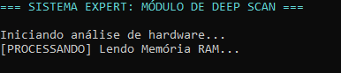

# 🚀 1ª Heurística de NielsenI

Este projeto aplica a 1ª Heurística de Nielsen (Visibilidade do Status do Sistema) que diz que o software deve sempre manter o usuário informado sobre o que está acontecendo, através de feedback apropriado e em tempo razoável.

## 📸 Evidência de Execução

